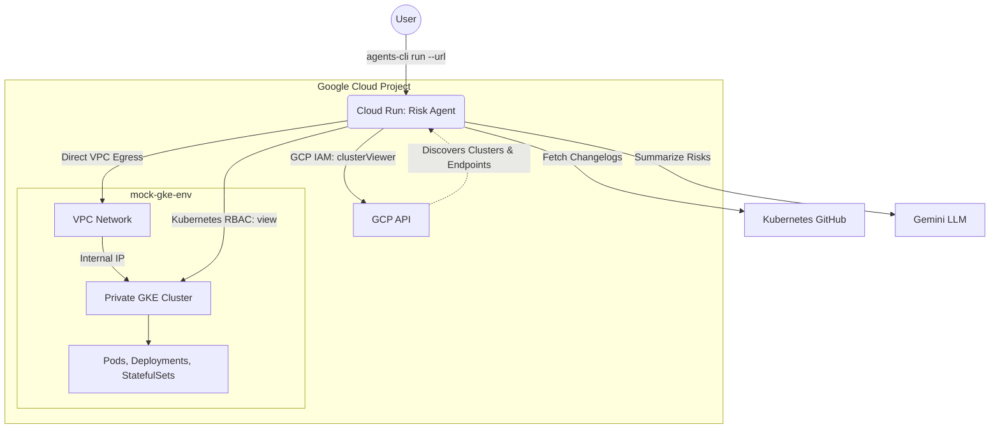

# GKE Upgrade Risk Agent & Mock Environment

This repository contains the complete ecosystem for testing and deploying the **GKE Upgrade Risk Agent**. The project is split into two main components:

1. **`mock-gke-env/`**: The target infrastructure. A Terraform module that provisions a private GKE cluster populated with diverse workloads (Deployments, StatefulSets, DaemonSets, etc.).
2. **`gke-upgrade-risk-agent/`**: The AI Agent. An ADK-based multi-agent system deployed to Cloud Run that securely connects to the private GKE cluster, analyzes running workloads, and cross-references them against Kubernetes Release Notes to evaluate upgrade risks.


---

## 🏗️ Architecture



## 🚀 Complete Deployment Guide

To test the full system from scratch, you must deploy the mock environment first, followed by the agent.

### 1. Deploy the Mock GKE Environment
The agent needs a cluster to analyze. This provisions a private cluster and VPC.
```bash
cd mock-gke-env
terraform init
terraform apply -auto-approve
cd ..
```
*See [`mock-gke-env/README.md`](mock-gke-env/README.md) for details.*

### 2. Deploy the AI Agent to Cloud Run
The agent's Terraform is pre-configured to read the `mock-gke-env` Terraform state to dynamically attach itself to the private VPC via Direct Egress.

```bash
cd gke-upgrade-risk-agent
# 1. Deploy the IAM Roles & Storage Buckets
agents-cli infra single-project

# 2. Deploy the Agent Code to Cloud Run
agents-cli deploy --region us-central1
cd ..
```
*See [`gke-upgrade-risk-agent/README.md`](gke-upgrade-risk-agent/README.md) for details.*

### 3. Grant Kubernetes Permissions (Crucial Step)
Even though the Cloud Run Agent has GCP permissions to see the cluster, it needs Kubernetes RBAC permissions to read the pods inside it.

```bash
# Get credentials for your new mock cluster
gcloud container clusters get-credentials mock-upgrade-cluster --zone us-central1-a

# Create the ClusterRoleBinding for the Cloud Run default compute service account
kubectl create clusterrolebinding agent-viewer \
  --clusterrole=view \
  --user="$(gcloud config get-value project_number)-compute@developer.gserviceaccount.com"
```

### 4. Talk to Your Deployed Agent!
Now that everything is deployed and wired together, you can query your live agent on Cloud Run from your local terminal using the URL provided at the end of the `agents-cli deploy --region us-central1` step.

```bash
agents-cli run \
  --url "https://gke-upgrade-risk-agent-YOUR_PROJECT_ID_HASH.us-central1.run.app" \
  --mode adk \
  "I want to upgrade my mock cluster to Kubernetes 1.30. What are the risks based on my current workloads?"
```