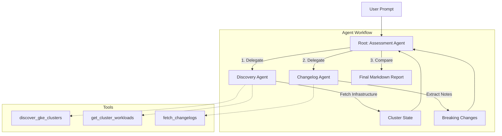

# GKE Upgrade Risk Agent

This directory contains the AI Agent responsible for discovering GKE clusters, inspecting their running workloads, and comparing them against Kubernetes Release Notes to evaluate upgrade risks.

It is built using the Google ADK (Agent Development Kit) framework.

## 🧠 Multi-Agent Architecture

The application uses a `SequentialAgent` workflow to separate concerns and improve LLM reliability:



### 🔒 Dual-Environment Authentication
The `get_cluster_workloads` tool is designed to work both locally and in production:
- **Local (`agents-cli playground`)**: Uses your local `~/.kube/config` and proxies.
- **Production (Cloud Run)**: Dynamically fetches the cluster CA and GCP OAuth tokens on the fly to instantiate a temporary, secure connection directly to the GKE Control Plane.

## 🚀 Deployment (Cloud Run)

This agent is configured to deploy to **Cloud Run**. Because it must scan private GKE clusters, the deployment requires specific networking configurations:

1. **VPC Direct Egress**: The Cloud Run service `terraform` uses a remote state data block to read the VPC network details from `mock-gke-env`.
2. **GCP IAM Permissions**: The Cloud Run service account is granted `roles/container.clusterViewer` to discover clusters.

### Deployment Steps
```bash
# 1. Deploy the required Infrastructure (Storage, BQ, Secrets, IAM)
agents-cli infra single-project

# 2. Deploy the containerized Agent Code
agents-cli deploy --region us-central1
```

## 📡 Remote Execution

Once deployed, you do not need to run the playground locally. You can trigger the remote agent directly from your terminal:

```bash
agents-cli run \
  --url "https://gke-upgrade-risk-agent-YOUR_PROJECT_ID_HASH.us-central1.run.app" \
  --mode adk \
  "What are the risks of upgrading the mock cluster to 1.30?"
```

## Requirements

- **uv**: Python package manager
- **agents-cli**: Google Agents CLI
- **Google Cloud SDK**: For GCP services
- **Terraform**: For infrastructure deployment
